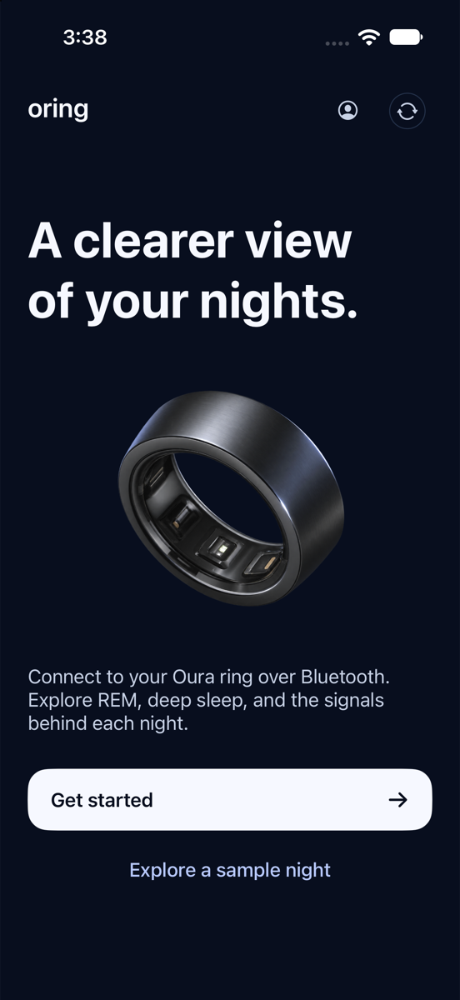
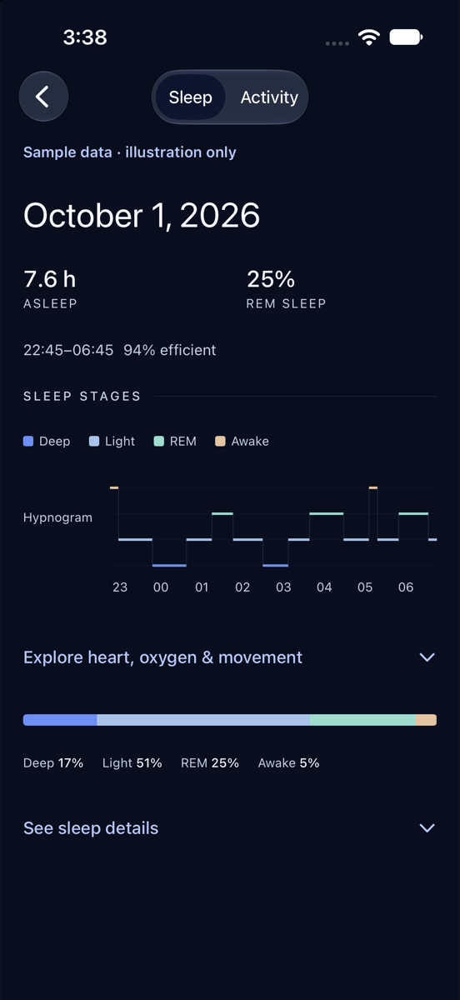
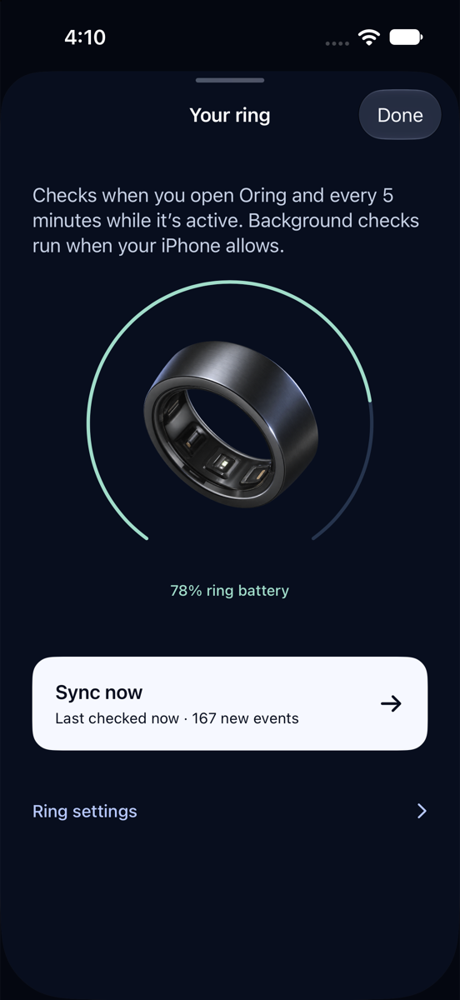
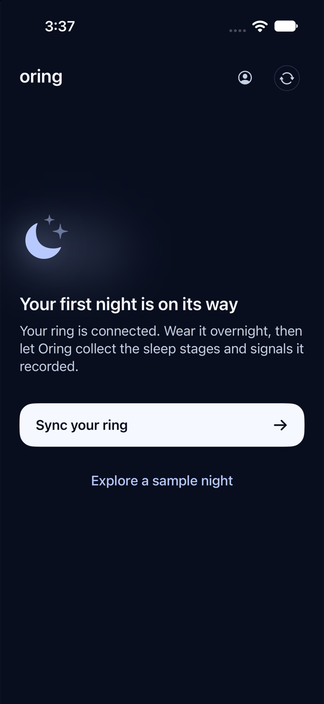
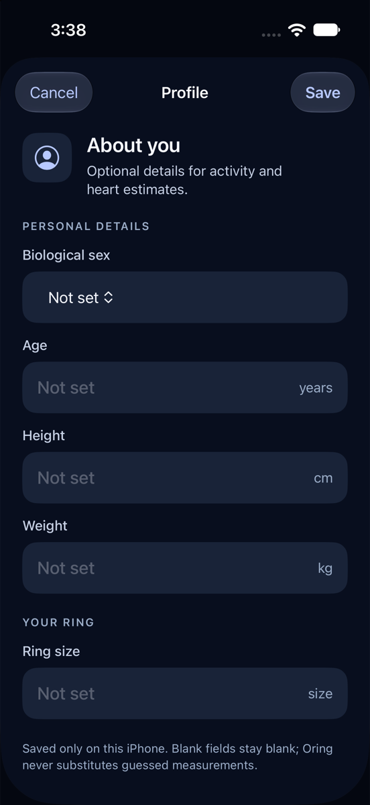

# Oring

A clearer view of your nights, straight from your ring.

Oring is a free iPhone app that talks to compatible Oura rings over Bluetooth. It keeps the ring's history on your phone and gives sleep stages, REM patterns, and overnight signals room to breathe. There is no Oring account, subscription, ad, server, or Apple Health connection.

<p align="center">
  
  
  
</p>

The ring screenshot is a simulator preview with sample values. The app shows the ring’s own readings after a real sync.

The sleep screen begins with time asleep and REM, then shows the night's deep, light, REM, and awake sequence. Heart rate, HRV, oxygen, temperature, and movement appear where the ring actually recorded them. Missing readings get an explanation instead of a made-up zero. A clearly labeled sample night is available before pairing.

## When there is nothing to show yet

The first-night screen explains the next step. Profile fields keep their labels and stay blank until you enter a value; Oring does not guess your measurements.

<p align="center">
  
  
</p>

## Connect a ring

Put the ring on its charger near the iPhone. Oring walks through one choice at a time:

1. **Already paired?** Enter the ring's existing 32-character pairing key. Oring cannot retrieve a lost key from the ring.
2. **Already factory reset?** Let Oring create a new key and save it in iOS Keychain. A factory reset erases unsynced ring data, so Oring never triggers one as part of setup.
3. **Sync.** The ring's events are written to a local SQLite database. The ring screen shows its reported battery, the last sync's new event count, and a manual **Sync now** action. Ring details, key management, and technical tools live under **Ring settings**.

In **Ring settings → Advanced & diagnostics**, you can delete the data saved on this iPhone or factory-reset the ring. Each action asks for one confirmation. Local deletion removes the saved history, profile, pairing key and diagnostics without changing the ring. Factory reset erases the ring's unsynced events and pairing state; Oring checks the ring's serial before sending that command.

If iOS says the ring “removed pairing information,” forget the ring under **iPhone Settings → Bluetooth**, then return to Oring and try again. That cleared the stale Bluetooth bond during the physical-ring test.

Oring checks on launch and about every five minutes while active. It also requests a background sync opportunity after an hour. iOS decides when, or whether, to run background work, so an hourly background sync is not guaranteed.

## Build it

You need Xcode, [XcodeGen](https://github.com/yonaskolb/XcodeGen), and Rust with the `aarch64-apple-ios` and `aarch64-apple-ios-sim` targets. The development build was made with Xcode 27.0.

```sh
bash apps/ios/build-xcframework.sh
cd apps/ios/OuraApp
xcodegen generate
open OuraApp.xcodeproj
```

Choose your Apple Developer team and run the `OuraApp` scheme on an iPhone. The installed app is named **Oring**. A simulator can show onboarding and the sample report, but cannot pair over Bluetooth. To run the simulator tests, replace the destination ID with one from `xcrun simctl list devices available`:

```sh
xcodebuild -project apps/ios/OuraApp/OuraApp.xcodeproj -scheme OuraApp \
  -destination 'platform=iOS Simulator,id=YOUR_SIMULATOR_ID' \
  -parallel-testing-enabled NO CODE_SIGNING_ALLOWED=NO test
```

The app uses native SwiftUI and CoreBluetooth around a Rust UniFFI core. The Bluetooth implementation builds on the MIT-licensed [open_health](https://github.com/Th0rgal/open_health) and [open_oura](https://github.com/Th0rgal/open_oura) work. See [third-party notes](docs/third-party.md) and [LICENSE](LICENSE). The ring artwork is an original, unbranded image made for this app; no Oura photograph or logo is bundled.

## Where it stands

Fresh pairing, live battery, and event sync ran on a physical ring and iPhone 16 Pro Max. The app displayed 120 new events in one sync. The sample sleep report and onboarding were exercised in the simulator. A full overnight capture and real sleep-stage report still need to be checked before making a sleep-compatibility claim for a particular model and firmware.

Oring is independent and is not affiliated with Oura Health. The Bluetooth protocol is reverse engineered and can change with ring firmware. Oring does not reproduce Oura's proprietary scores. App Store submission also needs the remaining steps in the [release handoff](docs/app-store.md) and a public copy of the [privacy policy](docs/privacy-policy.md).
